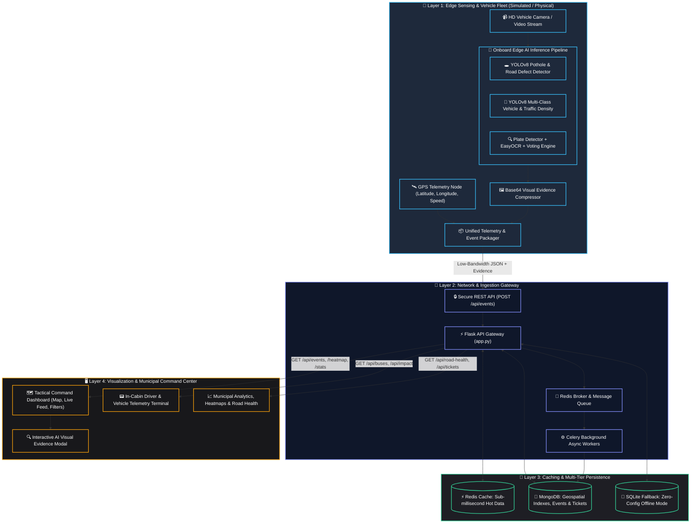

# 🚍 Urban Intelligence Platform (UIP)
### *AI-Powered Mobile Urban Sensing & Edge Intelligence via Public Transport Fleet*

[](https://www.python.org/)
[](https://flask.palletsprojects.com/)
[](https://docs.ultralytics.com/)
[](https://redis.io/)
[](https://www.mongodb.com/)
[](https://leafletjs.com/)
[](https://render.com/)

---

## 📌 Executive Summary

Modern cities struggle with real-time road maintenance, traffic congestion tracking, and surveillance due to expensive fixed sensor networks and static cameras with blind spots.

The **Urban Intelligence Platform (UIP)** transforms regular city public transit buses into **autonomous, mobile smart-city sensing nodes**. Equipped with front-facing camera sensors and onboard AI edge processors, transit buses passively monitor road surface defects (potholes/hazards), measure vehicle congestion density, and perform Automatic Number Plate Recognition (ANPR)—all while driving regular passenger routes.

### 💡 Core Innovation: Bandwidth-Efficient Edge AI
Instead of transmitting high-bandwidth video streams over cellular networks (4G/5G), our edge models run real-time inference on the vehicle. The bus transmits **only lightweight, structured telemetry JSON packets** accompanied by **high-relevance base64 visual evidence snapshots** when anomalies or checkpoints are triggered.

---

## 🏗️ System Architecture


### 📊 End-to-End Data Flow Diagram



---

### 🏛️ Architecture Breakdown by Layer

| Layer | Component | Technology | Responsibility |
|---|---|---|---|
| **1. Edge AI Layer** | `ai/pothole/` | YOLOv8 (fine-tuned) | Detects road damage & potholes; marks bounding boxes and severity. |
| | `ai/vehicle/` | YOLOv8 COCO | Multi-class vehicle counting (cars, bikes, buses, trucks) & congestion categorization (`LOW`, `MEDIUM`, `HIGH`). |
| | `ai/anpr/` | EasyOCR + Custom Voting | Plate detection, adaptive thresholding, Indian format regex matching & multi-frame character voting. |
| | `ai/pipeline/` | OpenCV + Python | Unifies multi-model video stream processing and packages events. |
| **2. API & Queue Layer** | `backend/app.py` | Flask, CORS | Validates payloads, coordinates routing, serves REST queries. |
| | `backend/tasks/` | Celery + Redis | Asynchronously processes batch event ingestion and heavy calculations. |
| **3. Caching & Storage** | `backend/database/` | Redis | In-memory cache for live events, stats, bus status, and heatmaps. |
| | `backend/database/` | MongoDB / SQLite | Persistent storage with geospatial query support and ticket workflow. |
| **4. Command Center** | `frontend/pages/` | HTML5, Vanilla JS, CSS3 | Tactical map with real-time markers, filtering, and evidence view. |
| | In-Bus HUD | Leaflet.js, Audio alert | In-cabin terminal simulating driver speed, route checkpoint, and live AI alerts. |
| | Municipal Analytics | Chart.js, Leaflet Heat | Heatmap visualization, road quality index, and infrastructure issue ticketing. |

---

## ✨ Key Features & Capabilities

- 🕳️ **Real-time Road Hazard Detection**: Automatically spots potholes and road fractures. Each defect is assigned a confidence score and GPS coordinate, and attaches an annotated snapshot so road maintenance teams can verify damage remotely.
- 🚦 **Dynamic Traffic & Congestion Telemetry**: Computes road density every few seconds without dedicated inductive loops or stationary sensors. Aggregates counts per vehicle category.
- 🚗 **High-Accuracy ANPR Pipeline**: Features bilateral filtering, adaptive Gaussian thresholding, Indian license plate format correction (`[A-Z]{2}\d{2}[A-Z]{1,2}\d{4}`), and multi-frame voting across successive detections to eliminate OCR jitter.
- 🎫 **Automated Maintenance Ticketing**: System converts high-severity road hazard alerts into actionable maintenance work-orders with lifecycle status tracking (`OPEN`, `IN_PROGRESS`, `RESOLVED`).
- ⚡ **Redis-Powered High Throughput**: Fast event caching and immediate cache invalidation on new writes ensure sub-5ms API response times.
- 🌐 **Cloud-Ready Hybrid Deployment**: Pre-configured for deployment with **Vercel** (frontend) and **Render** (backend & database).

---

## 📁 Repository Structure

```
urban-intelligence-platform/
├── ai/                                 # AI & Edge Inference Layer
│   ├── anpr/                           # License plate recognition & voting logic
│   │   └── detect_plate.py
│   ├── pothole/                        # Pothole detection model & scripts
│   │   ├── detect.py
│   │   └── best.pt                     # Fine-tuned YOLOv8 weights
│   ├── vehicle/                        # Multi-class vehicle counting & congestion
│   │   └── detect.py
│   └── pipeline/                       # Unified edge video processing pipelines
│       ├── unified_pipeline.py
│       └── pothole_pipeline.py
│
├── backend/                            # Flask REST API & Storage
│   ├── app.py                          # Core Flask application & routing
│   ├── config.py                       # Configuration (MongoDB, Redis, Celery)
│   ├── database/
│   │   ├── db.py                       # Dual-engine persistence (MongoDB + SQLite)
│   │   └── redis_cache.py              # Redis caching layer & invalidators
│   ├── tasks/
│   │   └── celery_tasks.py             # Asynchronous task workers
│   └── requirements.txt                # Python dependencies
│
├── frontend/                           # Command Center & Web Dashboards
│   └── pages/
│       ├── index.html                  # Main Command Center tactical map
│       ├── script.js                   # Map logic, real-time polling, modal handler
│       ├── style.css                   # Glassmorphic UI theme
│       ├── bus-monitor.html            # In-cabin driver telemetry terminal
│       ├── bus_monitor.js & .css       # In-bus telemetry logic
│       ├── analytics.html              # Municipal analytics & reporting
│       ├── analytics.js & .css         # Analytics charts & heatmap logic
│       └── config.js                   # API endpoint environment switcher
│
├── simulation/                         # Fleet & Telemetry Simulation
│   ├── fake_event_generator.py         # Simulates multi-bus telemetry across routes
│   └── mock_route.json                 # GPS waypoints along city corridors
│
├── docs/                               # Engineering Documentation
│   ├── api_contract.md                 # Strict API specification & event schemas
│   ├── architecture.md                 # Design notes & rationale
│   ├── datasets.md                     # Model datasets & training citations
│   └── deployment_guide.md             # Production guide (Render + Vercel)
│
├── render.yaml                         # Render deployment specification
├── vercel.json                         # Vercel static routing configuration
└── README.md                           # Project documentation
```

---

## 📡 API Contract & Telemetry Schema

Every edge AI detector and fleet node transmits events complying with the unified JSON specification:

```json
{
  "event_type": "pothole",
  "confidence": 0.92,
  "latitude": 19.0760,
  "longitude": 72.8777,
  "timestamp": "2026-09-28T10:15:30Z",
  "bus_id": "BUS-102",
  "image_base64": "data:image/jpeg;base64,/9j/4AAQSkZJRg...",
  "extra": {
    "severity": "HIGH",
    "route_id": "ROUTE-18",
    "dimensions": "45cm x 30cm"
  }
}
```

### Core API Endpoints

| Method | Endpoint | Description |
|---|---|---|
| `POST` | `/api/events` | Ingests a new telemetry/AI event from a bus |
| `GET` | `/api/events` | Retrieves filtered events (`?event_type=`, `?bus_id=`, `?limit=`) |
| `GET` | `/api/events/<id>` | Fetches single event with full visual evidence snapshot |
| `GET` | `/api/events/heatmap` | Returns weighted coordinate points for map heatmap layers |
| `GET` | `/api/stats` | Aggregated city statistics (counts, distributions, alerts) |
| `GET` | `/api/buses` | Fleet telemetry status, active buses, and last known locations |
| `GET` | `/api/road-health` | Road condition index scored per transit corridor |
| `GET` / `POST` | `/api/tickets` | Issue management for municipal road repairs |
| `PATCH` | `/api/tickets/<id>` | Update ticket status (`OPEN` ➔ `IN_PROGRESS` ➔ `RESOLVED`) |

---

## 🚀 Quickstart & Local Setup

### Prerequisites
- **Python 3.10+**
- (Optional) **Redis** server running locally (`localhost:6379`)
- (Optional) **MongoDB** connection string (falls back automatically to SQLite if omitted)

---

### Step 1: Backend Setup

```powershell
# Navigate to backend directory
cd backend

# Install dependencies
pip install -r requirements.txt

# Start the Flask API server (runs on http://localhost:5000)
python app.py
```

*Note: The backend automatically creates an SQLite database `database/events.db` if MongoDB is not configured.*

---

### Step 2: Frontend Setup

Open a new terminal:

```powershell
# Navigate to the frontend pages folder
cd frontend/pages

# Serve static files locally
python -m http.server 8080 --bind 127.0.0.1
```

Now open your browser:
- 🗺️ **Command Center Dashboard:** [http://localhost:8080](http://localhost:8080)
- 📟 **In-Cabin Bus Terminal:** [http://localhost:8080/bus-monitor.html](http://localhost:8080/bus-monitor.html)
- 📊 **City Analytics & Heatmap:** [http://localhost:8080/analytics.html](http://localhost:8080/analytics.html)

---

### Step 3: Run AI Edge Pipelines or Fleet Simulation

#### Option A: Run Telemetry Simulation (No camera or GPU needed)
Simulates a fleet of buses driving real routes and emitting live road hazard, traffic, and plate alerts:
```powershell
cd simulation
python fake_event_generator.py
```

#### Option B: Run Real AI Inference Pipelines on Video / Webcam
```powershell
# Pothole detection pipeline
python ai/pothole/detect.py path/to/road_video.mp4

# Vehicle counting and congestion analyzer
python ai/vehicle/detect.py path/to/traffic_video.mp4

# License plate recognition
python ai/anpr/detect_plate.py
```

---

## ☁️ Production Deployment

The project is structured for easy cloud deployment:

- **Frontend (Vercel)**:
  - Configured via `vercel.json`.
  - Connect your GitHub repository to Vercel and set root to `/` or `/frontend/pages`.
  - Set `window.API_BASE_URL` in `frontend/pages/config.js` to your deployed backend URL.

- **Backend (Render)**:
  - Configured via `render.yaml`.
  - Deploys Flask with Gunicorn: `gunicorn app:app --chdir backend`.
  - Environment variables: `MONGO_URI`, `REDIS_URL`.

For a full step-by-step production guide, see [docs/deployment_guide.md](docs/deployment_guide.md).

---

## 🛡️ License & Acknowledgements

Developed for the **Smart India Hackathon (SIH)**.  
Organization & Problem Statement: **Bharat Electronics Limited (BEL)** — *Smart Urban Infrastructure & Intelligent Transport Systems*.
