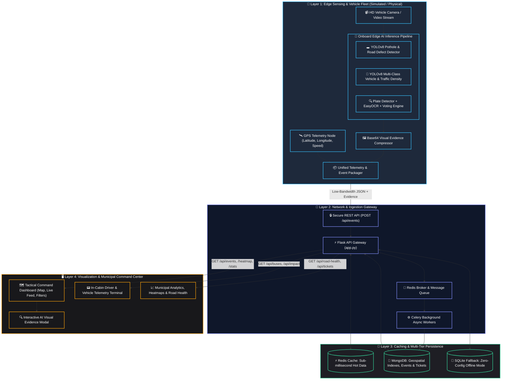

# Urban Intelligence Platform — Technical Architecture

This document provides a detailed breakdown of the architectural tiers, data flow, edge computing trade-offs, and communication contracts for the Urban Intelligence Platform (UIP).

---

## 1. High-Level System Architecture Diagram

---

## 2. Architectural Tiers

### Tier 1: Edge Sensing & Vehicle Fleet
- **Hardware Profile**: Designed to run on embedded edge accelerators (e.g., NVIDIA Jetson Orin Nano, Raspberry Pi 5 with Coral TPU) mounted on public transit buses.
- **Inference Pipeline**:
  - **Pothole Detection**: Custom fine-tuned YOLOv8 model running on incoming camera frames. When defect confidence crosses threshold (e.g. $\ge 0.50$), it computes bounding boxes and extracts visual crops.
  - **Traffic & Congestion Analyzer**: Pretrained YOLOv8 detects 4 vehicle classes (cars, motorcycles, buses, trucks). Calculates aggregate vehicle count and classifies traffic density into `LOW`, `MEDIUM`, or `HIGH` every checkpoint interval (e.g., 4 seconds).
  - **ANPR Engine**: Multi-stage detection using plate localization, bilateral filtering, adaptive Gaussian thresholding, Indian license plate format validation, and multi-frame voting across adjacent frames to ensure character accuracy.
- **Bandwidth Optimization**: Instead of streaming continuous gigabytes of raw video footage over 4G/LTE, the edge device transmits only structured JSON telemetry packets (typically 1–2 KB) with compressed base64 JPEG crops only when an anomaly is confirmed.

---

### Tier 2: Ingestion & API Gateway
- **Flask REST Gateway**: Receives standardized events via `POST /api/events`. Validates payload structure, checks required fields, and normalizes timestamp formats.
- **Asynchronous Task Processing**: High-throughput bursts are pushed to Redis queues and picked up by background Celery worker processes to prevent blocking client HTTP responses.

---

### Tier 3: Caching & Persistence
- **Redis In-Memory Cache**:
  - Caches high-frequency endpoints (`/api/events`, `/api/stats`, `/api/events/heatmap`, `/api/buses`).
  - Active cache invalidation triggers whenever new events are received or ticket statuses change.
- **Dual Engine Storage**:
  - **MongoDB**: Primary production database utilizing 2dsphere geospatial indexing for radius and bounding box spatial queries.
  - **SQLite**: Automatic zero-configuration fallback for offline testing, local demonstrations, and rapid prototyping.

---

### Tier 4: Municipal Command Center
- **Tactical Real-time Dashboard**: Built with Leaflet.js and responsive vanilla CSS/JS. Visualizes bus locations, hot-spots, and recent incidents with color-coded severity markers.
- **Interactive Evidence Viewer**: Allows municipal operators to view the original annotated image with the AI bounding box, verifying road maintenance tickets before dispatching work crews.
- **In-Bus Telemetry Terminal**: Provides drivers and conductors with a live cockpit display showing route speed, nearest GPS checkpoint, and real-time road hazard alerts ahead.
- **Analytics & Health Intelligence**: Offers aggregated reports on road degradation rates, traffic density histories, and ANPR identification logs.
